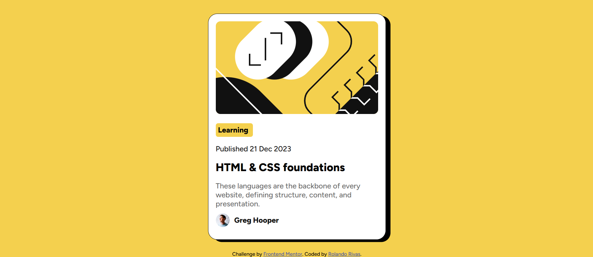

# Frontend Mentor - Blog preview card solution

This is a solution to the [Blog preview card challenge on Frontend Mentor](https://www.frontendmentor.io/challenges/blog-preview-card-ckPaj01IcS). Frontend Mentor challenges help you improve your coding skills by building realistic projects.

## Table of contents

- [Overview](#overview)
  - [The challenge](#the-challenge)
  - [Screenshot](#screenshot)
  - [Links](#links)
- [My process](#my-process)
  - [Built with](#built-with)
  - [What I learned](#what-i-learned)
  - [Continued development](#continued-development)
  - [Useful resources](#useful-resources)
- [Author](#author)
- [Acknowledgments](#acknowledgments)

## Overview

### The challenge

Users should be able to:

- See hover and focus states for all interactive elements on the page

### Screenshot

 
<!-- 
  TODO: Add your screenshot. 
  1. Take a screenshot of your project.
  2. Add it to a folder like `design` or `images` in your project.
  3. Update the path above (e.g., `./images/screenshot.png`).
-->

### Links

- Solution URL: [Add solution URL here](https://github.com/Rolando0408/Blog-preview-card)
- Live Site URL: [Add live site URL here](https://rolando0408.github.io/Blog-preview-card/)

## My process

### Built with

- Semantic HTML5 markup
- CSS custom properties
- Flexbox
- Local font integration (`@font-face`)
- Responsive design principles

### What I learned

This section is a great place to reflect on what you've learned. For example:

- How to effectively use `@font-face` for custom local fonts.
- Techniques for creating card layouts with Flexbox.
- Implementing hover states for interactive elements.
- Best practices for structuring HTML for accessibility and maintainability.

```css
/* Example of a CSS snippet I'm proud of or found challenging */
.card:hover h1 {
  color: hsl(47, 88%, 63%);
}
```

### Continued development

- Exploring more advanced CSS layout techniques (e.g., CSS Grid).
- Deepening my understanding of JavaScript for interactive components.
- Improving my workflow for responsive design.

### Useful resources

- MDN Web Docs - This is an invaluable resource for any web developer, providing detailed information on HTML, CSS, and JavaScript.
- CSS-Tricks - A great site for tips, tricks, and tutorials on all things CSS.
- Frontend Mentor - For providing the challenge and community.

## Author

- GitHub - [Rolando0408](https://github.com/Rolando0408)
- Frontend Mentor - [@Rolando0408](https://www.frontendmentor.io/profile/yourusername)
- Facebook - [@Rolando Rafael Rivas](https://www.facebook.com/rolando.rafael.rivas/?rdid=rx2vzCuCE6asKp8L)